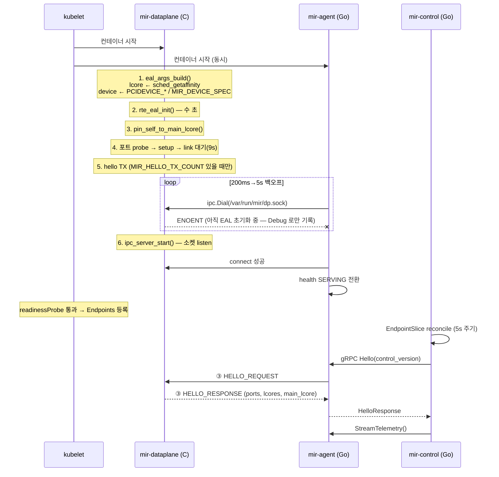
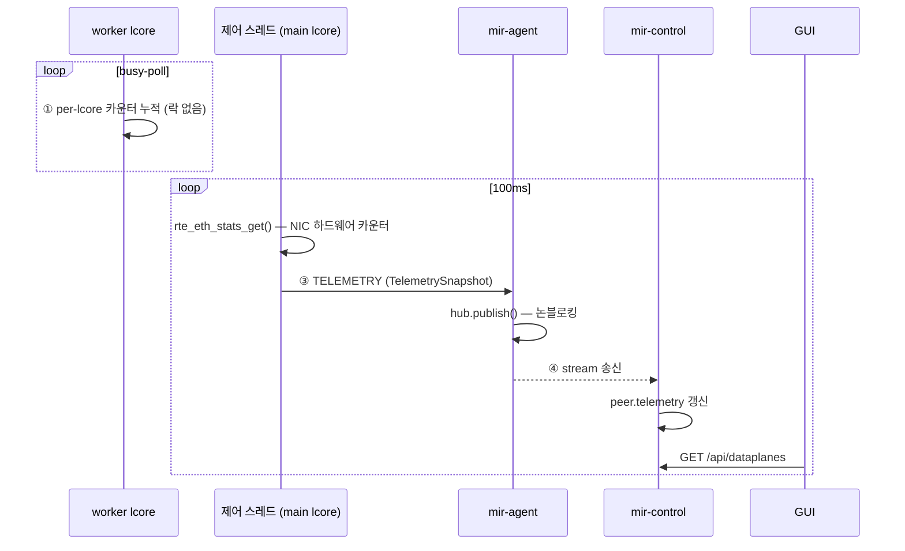
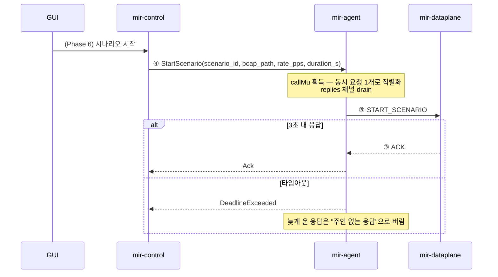
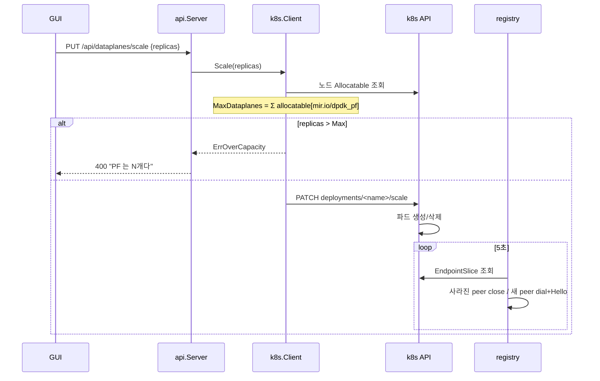

# Mir — 아키텍처 상세

이 문서는 **구현 관점**에서 구조와 호출 흐름을 서술한다.
요구사항·설계 결정의 단일 출처(SoT)는 [REQUIREMENTS.md](REQUIREMENTS.md)이고,
호스트 준비·배포 절차는 [DEPLOYMENT.md](DEPLOYMENT.md)다.

여기서 다루는 것: **프로세스 경계 · 채널 · 콜플로우 · 스레드/코어 모델 ·
로드맵과 코드의 매핑.**

---

## 1. 전체 구조

```
                    ┌─────────────────────────────┐
                    │  React + TS GUI  (Phase 6)  │
                    └──────────────┬──────────────┘
                                   │ REST / WebSocket
                    ┌──────────────▼──────────────┐
   k8s API ◀────────┤  mir-control  (Go)          │   제어부 파드 × 1
   (scale/patch)    │  registry · api · k8s       │
                    └──────────────┬──────────────┘
                                   │ ④ gRPC (스트리밍)
      ┌────────────────────────────┼────────────────────────────┐
      │                            │                            │
┌─────▼─────────────────┐   ┌──────▼────────────────┐          ...
│ mir-agent   (Go)      │   │ mir-agent             │   데이터플레인 파드 × N
│ 사이드카 · 공유 풀 코어 │   │                       │   (NIC PF 하나당 하나)
├───────────────────────┤   ├───────────────────────┤
│ ③ unix socket         │   │ ③                     │
├───────────────────────┤   ├───────────────────────┤
│ mir-dataplane (C/DPDK)│   │ mir-dataplane         │
│ 배타 코어 · busy-poll  │   │                       │
└───────────┬───────────┘   └───────────┬───────────┘
            │ NIC PF (vfio-pci)         │
        ════▼═══════════════════════════▼════  선로
```

### 프로세스를 나눈 이유

| 경계 | 이유 |
|---|---|
| C ↔ Go (③) | Go↔DPDK **cgo 오버헤드 회피**. C 를 순수 C 로 유지(libstdc++·abseil 불필요) |
| 사이드카 ↔ 제어부 (④) | gRPC 스레드 풀이 C 프로세스 cpuset(= worker 코어)을 떠도는 것을 **구조로 차단**. 별도 컨테이너라 물리적 경로 자체가 없다 |
| 제어부 ↔ 데이터플레인 (파드 분리) | 개수·리소스 변경은 **반드시 재시작을 수반**한다. 같은 파드면 제어부가 자기 자신을 죽이는 명령을 내리게 된다 |

> **개별 패킷(mbuf)은 프로세스 경계를 넘지 않는다.** 파드당 148 Mpps 를 밖으로
> 내보내는 것은 성립하지 않으므로, C 는 **판정 결과와 요약만** 올린다.
> 그래서 제어 채널이 지연되거나 끊겨도 판정 정확도에 영향이 없다.

---

## 2. 채널 5구간

스키마는 [`proto/dataplane.proto`](../proto/dataplane.proto) **하나**가 ③④ 두 hop 을
모두 정의한다. 사이드카가 대부분 그대로 통과시키는 릴레이라, 하나로 두면 갈라질 여지가 없다.

| # | 구간 | 방식 | 핵심 성질 |
|---|---|---|---|
| ① | worker lcore → 제어 스레드 | per-lcore 카운터 (`mir_stats[RTE_MAX_LCORE]`) | 캐시라인 정렬. **단일 writer** 라 락·원자연산 불필요 |
| ② | worker lcore → 제어 스레드 | `rte_ring` (lock-free MPSC) | full 이면 **버리고** drop 카운터만 증가. worker 는 절대 블로킹하지 않는다 |
| ③ | C ⇄ 사이드카 (파드 내부) | unix socket + protobuf-c | 4바이트 length-prefix. 네트워크가 아니라 재연결·백프레셔 문제가 거의 없다 |
| ④ | 사이드카 ⇄ 제어부 (파드 간) | **gRPC** 스트리밍 | headless Service EndpointSlice 로 자동 연결/해제 |
| ⑤ | 벌크 데이터 | 공유 볼륨 (PV) | PCAP 은 GB 단위 → **경로 문자열만** 전달 |

### ③ 와이어 포맷

`dataplane/src/ipc_server.c` 와 `control/internal/ipc/frame.go` 가 이 포맷을 공유한다.

```
+--------+--------+------------------+
| u32 be | u16 be |     payload      |
| length |  type  |    (protobuf)    |
+--------+--------+------------------+

length = sizeof(type) + sizeof(payload)   ← 자기 자신은 제외
type   = MsgType (100 미만 = 제어부→DP, 100 이상 = DP→제어부)
```

**C 가 서버다.** `rte_eal_init()` 이 수 초 걸리므로 사이드카가 재시도하며 붙는 편이
자연스럽다. 반대로 하면 C 가 부팅 중 사이드카를 기다려야 한다.

---

## 3. 콜플로우

### 3-1. 기동 시퀀스



**핵심**: 사이드카는 데이터플레인이 붙기 전까지 `NOT_SERVING` 이다. 그래서 EAL
초기화 중인 파드는 Endpoints 에 들어가지 않고, 제어부가 헛되이 연결하지 않는다.

### 3-2. 텔레메트리 (100ms push)



포트별 수치는 **NIC 하드웨어 카운터**(`rte_eth_stats_get`)에서 온다. per-lcore
카운터(①)는 포트로 분해되지 않을뿐더러, 큐에 넣은 수와 NIC 이 실제로 내보낸 수가
어긋나는 것 자체가 봐야 할 정보다. 이 API 는 제어 경로라 worker 의 burst 루프를
방해하지 않는다.

**백프레셔는 전 구간이 "버린다"로 통일돼 있다.**

| 지점 | full 일 때 | 관측 |
|---|---|---|
| ② `rte_ring` | 버리고 drop 카운터 증가 | `TelemetrySnapshot.event_drop` |
| agent `hub` (버퍼 32) | 버리고 경고 로그 | "구독자가 느려 … 드롭" |

느린 GUI 하나가 릴레이 전체를, 느린 제어부가 worker 를 멈추게 두지 않는다.

### 3-3. 명령 (StartScenario)



> ⚠️ **프레임에 request id 가 없다.** 그래서 `callMu` 로 한 번에 하나의 요청만
> in-flight 로 둔다. 명령은 초당 수 건이라 이 단순화의 대가가 없지만,
> **동시 요청이 필요해지면 proto 에 correlation id 를 넣어야 한다.**

> ⚠️ **현재 `StartScenario` 는 `ok=false` + `"송신 엔진 미구현 (Phase 1~4-1)"` 을
> 돌려준다.** 성공을 가장하지 않는다. PCAP 은 ⑤ 채널(공유 볼륨)을 경유하므로
> 이 요청에는 **경로 문자열만** 실린다.

### 3-4. 개수 조정 (scale)



**상한 검증을 API 단계에서 하는 이유**: 통과시키면 초과분이 조용히 `Pending` 에
쌓이고, 사용자는 파드 이벤트를 뒤져야 원인을 알게 된다.

**무중단은 불가능하다** — 세 겹의 제약이 겹쳐 있다:

1. Pod 의 `spec.containers` 는 **불변** → 변경 = Pod 재생성
2. in-place resize 는 static CPU manager + Guaranteed 조합에서 **Infeasible**
   (hugepages·확장 리소스는 애초에 resize 대상도 아니다)
3. **DPDK 가 런타임 lcore 변경을 지원하지 않는다** (`rte_eal_init` 이 고정)

목표는 무중단이 아니라 **재시작 범위를 데이터플레인으로만 한정**하는 것이다.
`SetResources` 는 strategic merge patch 로 `dataplane` 컨테이너만 겨냥한다 —
사이드카(`agent`)는 공유 풀에 남아야 하므로 건드리지 않는다.

### 3-5. 연결 끊김과 복구

**별도 처리가 없다는 것이 설계다.** 각 계층이 스스로 재시도한다.

| 끊긴 지점 | 복구 주체 | 방식 |
|---|---|---|
| ③ C ⇄ 사이드카 | `agent.Run` | 200ms → 5s 지수 백오프 재연결, health `NOT_SERVING` 전환 |
| ④ 사이드카 ⇄ 제어부 | `peer.run` | 2s 백오프로 Hello 재시도 → 성공 시 스트림 재개 |
| 파드 재생성 (IP 변경) | `registry.reconcile` | 5초 주기 EndpointSlice 조회로 자동 해제/연결 |

데이터플레인이 리소스 변경으로 롤링 재생성되면 주소가 바뀌는데, `reconcile` 이
알아서 끊고 다시 붙기 때문에 **재시작 후 복구 로직이 따로 없다.**

---

## 4. 스레드 · 코어 모델

이 프로젝트에서 **가장 조용히 깨지기 쉬운 부분**이다.

```
데이터플레인 컨테이너  cpu: "5"  (정수)  → CPU Manager static 이 배타 코어 5개 할당
  ├─ main lcore    : 메인 스레드 + 제어 스레드(ipc_server)
  └─ worker lcore×4: busy-poll TX/RX (Phase 2~)

사이드카 컨테이너      cpu: "500m" (분수) → 공유 풀에 잔류
  └─ gRPC 스레드 풀
```

**세 겹으로 격리를 건다:**

1. **컨테이너 분리** — 사이드카가 별도 컨테이너라 cpuset 이 물리적으로 분리된다.
   `agent` 의 cpu 를 실수로 **정수**로 주면 이 격리가 조용히 깨진다
2. **`pin_self_to_main_lcore()`** — 리눅스에서 새 스레드는 생성한 스레드의
   affinity 마스크를 **상속**한다. 메인 스레드를 main lcore 에 한 번 고정해 두면
   이후 `pthread_create` 로 만든 모든 스레드(제어 스레드, 나중에 붙을 어떤
   라이브러리의 내부 스레드든)가 main lcore 에 갇힌다
3. **커널 `isolcpus`** — 스케줄러가 애초에 그 코어에 태스크를 올리지 않는다

> ⚠️ 3번은 **HT 형제 관계까지 따져야** 유효하다. 검증기에서 `isolcpus=0-23` 이
> 24개 물리코어 전부의 첫 스레드를 가리켜 격리가 성립하지 않는 사례가 실측됐다.
> → [10-kernel-cmdline.md](../deploy/host/10-kernel-cmdline.md)

### EAL 인자는 런타임에 조립한다

k8s CPU Manager 는 **임의의** 배타 코어를 주므로 `-l 1-4` 같은 하드코딩은 반드시
깨진다. PCI 주소도 device plugin 이 파드마다 다르게 주입한다.

| 인자 | 출처 |
|---|---|
| lcore 목록 | `sched_getaffinity(2)` — 실제 할당된 cpuset |
| 장치 | `PCIDEVICE_*` (device plugin) 또는 `MIR_DEVICE_SPEC` |
| `--file-prefix` | `HOSTNAME` — 같은 노드의 파드 간 hugepage 충돌 방지 |

`device_spec_kind` 는 `PCI_BDF` / `MAC_ADDR` 두 갈래를 미리 열어 뒀다. Azure MANA
PMD 가 BDF 가 아니라 **MAC 주소**로 바인딩 대상을 정하기 때문이다(Phase 8).

---

## 5. 데이터 경로 tier

PMD 만 바꾸면 `rte_ethdev` API 가 동일해 **데이터플레인 코드는 그대로**고
EAL 인자만 달라진다. 상세·주의사항은 [REQUIREMENTS 4-1-1](REQUIREMENTS.md).

```
Tier 1  -a 0000:43:00.0                    ← vfio 독점. 정본
Tier 2  --vdev net_af_xdp0,iface=eth2      ← 커널이 NIC 소유
Tier 3  --vdev net_af_packet0,iface=eth2   ← 준비물 없음. --no-huge 가능
```

> ⚠️ Tier 2·3 은 커널 TCP 스택이 같은 패킷을 본다. ACK 를 생략하면 돌아온
> SYN-ACK 에 커널이 **RST 를 쏴 시나리오를 오염시킨다.** 기능 개발용이고,
> 성능·handshake 정확도 검증은 반드시 Tier 1 에서 한다.

---

## 6. 로드맵 × 코드 매핑

각 Phase 가 이 아키텍처의 **어느 부분을 건드리는지**로 정리한다.

| Phase | 상태 | 건드리는 곳 | 채널 |
|---|:---:|---|---|
| **0** 환경/HW + 인프라 골격 | ✅ | `eal_args.c` · `ipc_server.c` · `deploy/**` · `internal/{k8s,registry,api}` | ③④ 확립 |
| **1** hello packet | ✅ | `port.c` · `tx_hello.c` | — |
| **2** L2~L4 고속 송신 | ⬜ | **헤더 빌더 신설** · worker lcore 루프 · 속도 제어 | **① 실사용 시작** |
| **3** 수신 캡처 + 판정 | ⬜ | RX 루프 · 실시간 판정 → `Event` 생성 | **② 실사용 시작** |
| **4** handshake 제어 | ⬜ | 세션 상태 기계 (ACK 생략 등) | ② |
| **4-1** PCAP 리플레이 | ⬜ | `pcap_reader.h` 구현 · `StartScenario` 실동작 | **⑤ 실사용 시작** |
| **5** TLS + HTTP stateful | ⬜ | 세션 엔진 (모드 B) | ② |
| **6** GUI | ⬜ | `internal/api` 확장 + React | REST/WS |
| **7** 400G 튜닝 | ⬜ | lcore 스케일링 · 배치 · NUMA/캐시. **목표기 도입 전제** | — |
| **8** 클라우드 이식 | ⬜ | `device_spec` 의 `MAC_ADDR` 경로 · PMD 추가 | — |

### 지금 무엇이 실제로 도는가

- **채널 ③④ 는 완성**돼 있다. Hello · 텔레메트리 · Ack 가 전 구간 왕복한다
- **채널 ①② 는 구조만 있고 실사용 전**이다. worker lcore 가 아직 없기 때문에
  (`mir_stats` 는 선언돼 있으나 기록하는 주체가 Phase 2 에서 생긴다)
- **`StartScenario` 는 "미구현" Ack** 를 정직하게 돌려준다
- 텔레메트리의 포트별 수치는 **NIC 하드웨어 카운터**에서 오므로, 송신 엔진이
  없어도 링크 상태와 드라이버 동작을 관측할 수 있다
- **실물 하드웨어 미검증** — C 코드는 컴파일 검증조차 되지 않았다.
  검증기 준비 상태는 [REQUIREMENTS 7절 Open Issue 2](REQUIREMENTS.md)

### Phase 2 에서 처음 마주칠 것

worker lcore 가 생기는 순간 이 문서의 **4절(스레드·코어 모델)이 실제 제약이 된다.**
그 전까지는 제어 스레드 하나뿐이라 격리가 깨져도 증상이 드러나지 않는다.
`rte_ring`(②) 도 그때 처음 트래픽을 받는다.

---

## 7. REST API

`internal/api/server.go`. GUI(Phase 6)가 소비할 면이다.

| 메서드 | 경로 | 용도 |
|---|---|---|
| `GET` | `/healthz` | 연결된 데이터플레인 수 / 전체 |
| `GET` | `/api/capacity` | 노드별 allocatable PF·CPU·hugepage, `maxDataplanes` |
| `GET` | `/api/dataplanes` | **k8s 가 아는 것 + 제어부가 아는 것을 병합** |
| `PUT` | `/api/dataplanes/scale` | 개수 조정 (상한 초과 시 400) |
| `PUT` | `/api/dataplanes/resources` | cpu·memory·hugepages (응답에 `restartRequired: true`) |
| `POST` | `/api/dataplanes/{name}/restart` | 파드 삭제 → Deployment 가 재생성 |

`/api/dataplanes` 가 두 출처를 합치는 이유: 둘 중 하나만 보면 원인 파악이 어렵다.
**`Running` 인데 `connected=false`** 면 사이드카나 EAL 초기화 쪽으로 문제가 좁혀진다.
`Pending` 의 사유(대개 PF 부족)도 `message` 에 그대로 노출한다.
